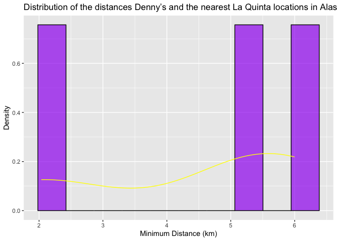
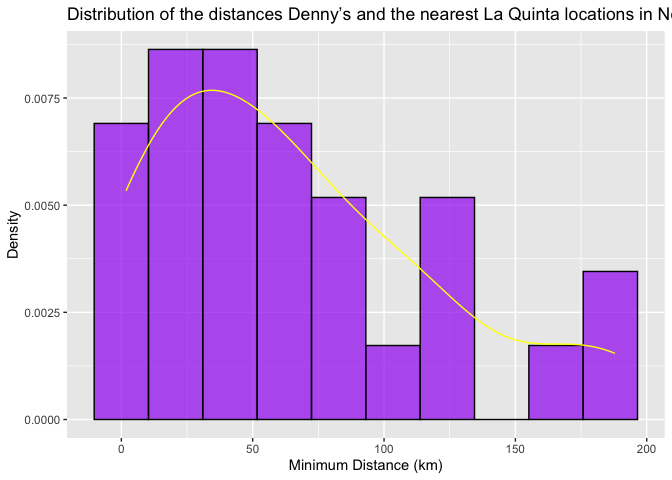
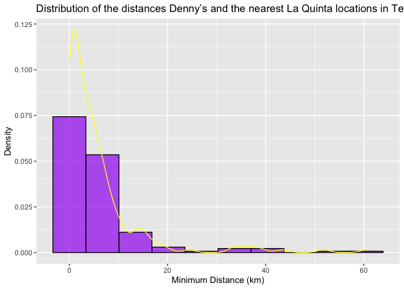
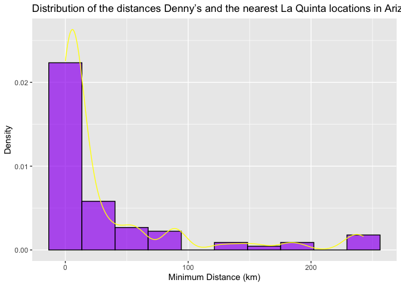

Lab 05 - Wrangling spatial data
================
Enhui Wang
2025.02.10

### Load packages and data

``` r
library(tidyverse) 
library(dsbox) 
```

``` r
states <- read_csv("data/states.csv")
```

### Exercise 1

There are 3 Denny’s location and 2 La Quinta’s location in Alaska.

``` r
#filter the Denny’s data frame for Alaska (AK)
dn_ak <- dennys %>%
  filter(state == "AK")
nrow(dn_ak)
```

    ## [1] 3

``` r
#filter the La Quinta’s data frame for Alaska (AK)
lq_ak <- laquinta %>%
  filter(state == "AK")
nrow(lq_ak)
```

    ## [1] 2

### Exercise 2

There are 6 pairings.

``` r
#the number of pairings
num_pairings <- nrow(dn_ak) * nrow(lq_ak)
num_pairings
```

    ## [1] 6

### Exercise 3

There are 6 pairings.

``` r
#join the data on Denny’s and La Quinta locations in Alaska
dn_lq_ak <- full_join(dn_ak, lq_ak, 
                      by = "state")
```

    ## Warning in full_join(dn_ak, lq_ak, by = "state"): Detected an unexpected many-to-many relationship between `x` and `y`.
    ## ℹ Row 1 of `x` matches multiple rows in `y`.
    ## ℹ Row 1 of `y` matches multiple rows in `x`.
    ## ℹ If a many-to-many relationship is expected, set `relationship =
    ##   "many-to-many"` to silence this warning.

``` r
dn_lq_ak
```

    ## # A tibble: 6 × 11
    ##   address.x     city.x state zip.x longitude.x latitude.x address.y city.y zip.y
    ##   <chr>         <chr>  <chr> <chr>       <dbl>      <dbl> <chr>     <chr>  <chr>
    ## 1 2900 Denali   Ancho… AK    99503       -150.       61.2 3501 Min… "\nAn… 99503
    ## 2 2900 Denali   Ancho… AK    99503       -150.       61.2 4920 Dal… "\nFa… 99709
    ## 3 3850 Debarr … Ancho… AK    99508       -150.       61.2 3501 Min… "\nAn… 99503
    ## 4 3850 Debarr … Ancho… AK    99508       -150.       61.2 4920 Dal… "\nFa… 99709
    ## 5 1929 Airport… Fairb… AK    99701       -148.       64.8 3501 Min… "\nAn… 99503
    ## 6 1929 Airport… Fairb… AK    99701       -148.       64.8 4920 Dal… "\nFa… 99709
    ## # ℹ 2 more variables: longitude.y <dbl>, latitude.y <dbl>

### Exercise 4

There are 6 observations.

``` r
nrow((dn_lq_ak))
```

    ## [1] 6

### Exercise 5

We use mutate() function.

``` r
haversine <- function(long1, lat1, long2, lat2, round = 3) {
  # convert to radians
  long1 <- long1 * pi / 180
  lat1 <- lat1 * pi / 180
  long2 <- long2 * pi / 180
  lat2 <- lat2 * pi / 180

  R <- 6371 # Earth mean radius in km

  a <- sin((lat2 - lat1) / 2)^2 + cos(lat1) * cos(lat2) * sin((long2 - long1) / 2)^2
  d <- R * 2 * asin(sqrt(a))

  return(round(d, round)) # distance in km
}
```

…

### Exercise 6

``` r
#generate all combinations of Denny's and La Quinta locations.
dn_lq_ak <- expand.grid(
  dn_id = 1:nrow(dn_ak),# Denny's locations
  lq_id = 1:nrow(lq_ak) # La Quinta locations
)
#get the coordinates for each  pair of Denny’s and La Quinta locations
dn_lq_ak <- dn_lq_ak %>%
  mutate(
    dn_lat = dn_ak$latitude[dn_id],
    dn_lon = dn_ak$longitude[dn_id],
    lq_lat = lq_ak$latitude[lq_id],
    lq_lon = lq_ak$longitude[lq_id]
  )
#use the haversine function to calculate the distance
dn_lq_ak <- dn_lq_ak %>%
  mutate(
    distance = haversine(dn_lon, dn_lat, lq_lon, lq_lat)
  )
# check the updated data frame
head(dn_lq_ak)
```

    ##   dn_id lq_id  dn_lat    dn_lon   lq_lat    lq_lon distance
    ## 1     1     1 61.1953 -149.8767 61.18843 -149.9119    2.035
    ## 2     2     1 61.2097 -149.8090 61.18843 -149.9119    5.998
    ## 3     3     1 64.8366 -147.7600 61.18843 -149.9119  419.879
    ## 4     1     2 61.1953 -149.8767 64.82426 -147.8660  416.031
    ## 5     2     2 61.2097 -149.8090 64.82426 -147.8660  413.653
    ## 6     3     2 64.8366 -147.7600 64.82426 -147.8660    5.197

### Exercise 7

The minimum distance is 2.035km.

``` r
dn_lq_ak_mindist <- dn_lq_ak %>%
  group_by(dn_id) %>% #groups the data by each unique Denny's location
  summarize(closest = min(distance))#calculates the minimum distance between a Denny's and La Quinta for each Denny’s location.
print(dn_lq_ak_mindist )
```

    ## # A tibble: 3 × 2
    ##   dn_id closest
    ##   <int>   <dbl>
    ## 1     1    2.04
    ## 2     2    6.00
    ## 3     3    5.20

### Exercise 8

``` r
#summary statistics
summary_stats <- summary(dn_lq_ak_mindist$closest)
print(summary_stats)
```

    ##    Min. 1st Qu.  Median    Mean 3rd Qu.    Max. 
    ##   2.035   3.616   5.197   4.410   5.598   5.998

``` r
#visualization histogram with density
library(ggplot2)

ggplot(dn_lq_ak_mindist, aes(x = closest)) +
  #create a histogram
  geom_histogram(aes(y = ..density..), bins = 10, fill = "purple", alpha = 0.7, color = "black") +
  #create a density curve
  geom_density(color = "yellow") +
  labs(
    title = "Distribution of the distances Denny’s and the nearest La Quinta locations in Alaska",
    x = "Minimum Distance (km)",
    y = "Density"
  )
```

    ## Warning: The dot-dot notation (`..density..`) was deprecated in ggplot2 3.4.0.
    ## ℹ Please use `after_stat(density)` instead.
    ## This warning is displayed once every 8 hours.
    ## Call `lifecycle::last_lifecycle_warnings()` to see where this warning was
    ## generated.

<!-- --> \### Exercise
9 The closest Denny’s and La Quinta pairing is 1.779 km. The
distribution is positively skewed.

``` r
#filter Denny’s and La Quinta Data Frames for NC
dn_nc <- dennys %>%
  filter(state == "NC")
# filter La Quinta for North Carolina
lq_nc <- laquinta %>%
  filter(state == "NC") 

#join data frames to get a complete list of all possible pairings
dn_lq_nc <- expand.grid(
  dn_id = 1:nrow(dn_nc),# Denny's locations
  lq_id = 1:nrow(lq_nc) # La Quinta locations
) %>%
  mutate(
    dn_lat = dn_nc$latitude[dn_id],
    dn_lon = dn_nc$longitude[dn_id],
    lq_lat = lq_nc$latitude[lq_id],
    lq_lon = lq_nc$longitude[lq_id]
  )
#calculate the distances between all possible pairings of Denny’s and La Quinta in NC
dn_lq_nc <- dn_lq_nc %>%
  mutate(
    distance = haversine(dn_lon, dn_lat, lq_lon, lq_lat)
  )

#find the minimum distance between each Denny’s and La Quinta location
dn_lq_nc_mindist <- dn_lq_nc %>%
  group_by(dn_id) %>%
  summarize(closest = min(distance))

#summary statistics
summary_stats <- summary(dn_lq_nc_mindist$closest)
print(summary_stats)
```

    ##    Min. 1st Qu.  Median    Mean 3rd Qu.    Max. 
    ##   1.779  22.388  53.456  65.444  93.985 187.935

``` r
#visualization histogram with density 
ggplot(dn_lq_nc_mindist, aes(x = closest)) +
  #create a histogram
  geom_histogram(aes(y = ..density..), bins = 10, fill = "purple", alpha = 0.7, color = "black") +
  geom_density(color = "yellow") +
  labs(
    title = "Distribution of the distances Denny’s and the nearest La Quinta locations in North Carolina",
    x = "Minimum Distance (km)",
    y = "Density"
  ) 
```

<!-- -->

### Exercise 10

The closest Denny’s and La Quinta pairing is 0.016 km. The distribution
is positively skewed, and the most distances are concentrated near the
lower range. Overall, Denny’s and La Quinta locations in Texas are
located very close to each other.

``` r
#filter Denny’s and La Quinta Data Frames for Texas
dn_tx <- dennys %>%
  filter(state == "TX")
# filter La Quinta for Texas
lq_tx<- laquinta %>%
  filter(state == "TX") 

#join data frames to get a complete list of all possible pairings
dn_lq_tx <- expand.grid(
  dn_id = 1:nrow(dn_tx), # Denny's locations
  lq_id = 1:nrow(lq_tx)  # La Quinta locations
) %>%
  mutate(
    dn_lat = dn_tx$latitude[dn_id],
    dn_lon = dn_tx$longitude[dn_id],
    lq_lat = lq_tx$latitude[lq_id],
    lq_lon = lq_tx$longitude[lq_id]
  )
#calculate the distances between all possible pairings of Denny’s and La Quinta in Texas
dn_lq_tx <- dn_lq_tx %>%
  mutate(
    distance = haversine(dn_lon, dn_lat, lq_lon, lq_lat)
  )

#find the minimum distance between each Denny’s and La Quinta location
dn_lq_tx_mindist <- dn_lq_tx %>%
  group_by(dn_id) %>%
  summarize(closest = min(distance))

#summary statistics
summary_stats <- summary(dn_lq_tx_mindist$closest)
print(summary_stats)
```

    ##    Min. 1st Qu.  Median    Mean 3rd Qu.    Max. 
    ##  0.0160  0.7305  3.3715  5.7918  6.6303 60.5820

``` r
#visualization histogram with density 
ggplot(dn_lq_tx_mindist, aes(x = closest)) +
  #create a histogram
  geom_histogram(aes(y = ..density..), bins = 10, fill = "purple", alpha = 0.7, color = "black") +
  geom_density(color = "yellow") +
  labs(
    title = "Distribution of the distances Denny’s and the nearest La Quinta locations in Texas",
    x = "Minimum Distance (km)",
    y = "Density"
  ) 
```

<!-- --> \###
Exercise 12 I choose Arizona for this exercise. The closest Denny’s and
La Quinta pairing is 0.021 km. The distribution is positively skewed,
and the most distances are concentrated near the lower range. Overall,
Denny’s and La Quinta locations in Arizona are located very close to
each other.

``` r
#filter Denny’s and La Quinta Data Frames for Arizona
dn_az <- dennys %>%
  filter(state == "AZ")
# filter La Quinta for Arizona
lq_az<- laquinta %>%
  filter(state == "AZ") 

#join data frames to get a complete list of all possible pairings
dn_lq_az <- expand.grid(
  dn_id = 1:nrow(dn_az), # Denny's locations
  lq_id = 1:nrow(lq_az)  # La Quinta locations
) %>%
  mutate(
    dn_lat = dn_az$latitude[dn_id],
    dn_lon = dn_az$longitude[dn_id],
    lq_lat = lq_az$latitude[lq_id],
    lq_lon = lq_az$longitude[lq_id]
  )
#calculate the distances between all possible pairings of Denny’s and La Quinta in Arizona
dn_lq_az <- dn_lq_az %>%
  mutate(
    distance = haversine(dn_lon, dn_lat, lq_lon, lq_lat)
  )

#find the minimum distance between each Denny’s and La Quinta location
dn_lq_az_mindist <- dn_lq_az %>%
  group_by(dn_id) %>%
  summarize(closest = min(distance))

#summary statistics
summary_stats <- summary(dn_lq_az_mindist$closest)
print(summary_stats)
```

    ##    Min. 1st Qu.  Median    Mean 3rd Qu.    Max. 
    ##   0.021   4.629   7.946  36.936  38.067 242.734

``` r
#visualization histogram with density 
ggplot(dn_lq_az_mindist, aes(x = closest)) +
  #create a histogram
  geom_histogram(aes(y = ..density..), bins = 10, fill = "purple", alpha = 0.7, color = "black") +
  geom_density(color = "yellow") +
  labs(
    title = "Distribution of the distances Denny’s and the nearest La Quinta locations in Arizona",
    x = "Minimum Distance (km)",
    y = "Density"
  ) 
```

<!-- --> \#Exercise
13 Mitch Hedberg’s joke most likely to hold true in Texas. Because the
minimum distance is 0.016 km, suggesting the locations overlap with each
other. According to the visualization, the distribution is relatively
highly positively skewed in Texas compared to other states, suggesting
the majority of Denny’s and La Quinta locations are close to each other.
